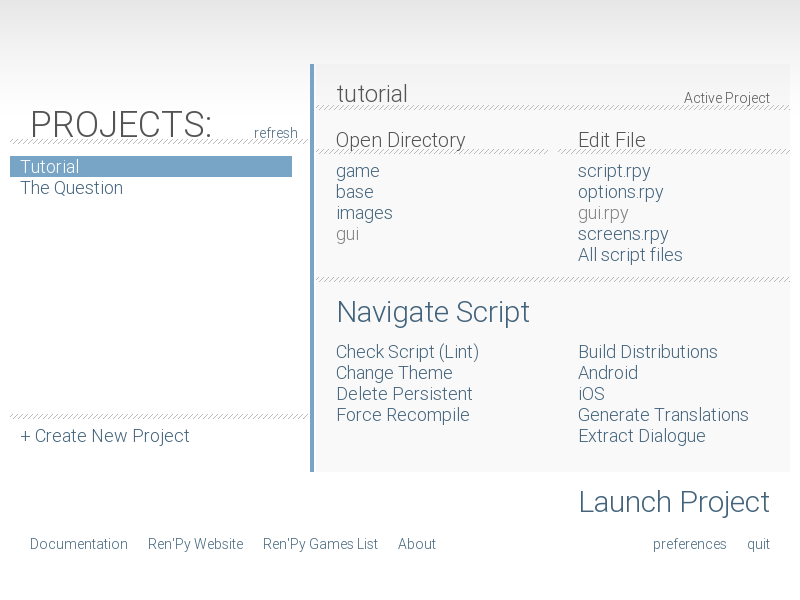

# Storyboard Ren'Py Guide Document
Hi everyone! It's Kat (@kat on Slack) and this is the written guide to How to Start Making a Ren'Py Game: adapted from the Ren'Py Quickstart Documentation & Shyla(@sprinkles on Slack)'s Ren'Py Tutorial Slideshow :D
> I (Kat) made this which means I get to license it! View the license [here :D]()
## Step 1: Download Ren'Py
click [here](https://www.renpy.org/latest.html) 
for the download link!
### For Windows
- click "Download SDK 7z.exe"
- Double-click file
- Open folder "renpy-&lt;version>"
- Run renpy.exe (or renpy)
### For Linux
- Click "Download ARM Linux (Raspberry Pi and Chromebook) SDK tar.bz2"
- unpack tarball
- Go to "renpy-&lt;version>"
- Run renpy.sh
### For Mac
- Double-click file
- Drag renpy-<version> somewhere else
- Open it and run renpy!

This is what the Ren'Py launcher should look like when you download & open it.

## Step 2: Let's check out an example game!
When you open the Ren'Py launcher, under "Projects" there should be two tabs: "Tutorial" and "The Question." You want to click on "The Question" and then click "Launch Project" to play the visual novel!
When you're in the visual novel, you want to press Start to play the game, and when you want to exit, press esc on your keyboard, then press Quit.
### A quick refresher...
If you ever want a refresher on anything you learn, check out the Tutorial game! To open it, you want to click the "Tutorial" tab, then click "Launch Project".
Now that you know a bit about Ren'Py, wou can start making your very own visual novel!!
## Step 3: Creating your game
Exciting!! To make your game, Click "+ Create New Project" under the projects.
### Let's set the game up...
#### Language
- If accurate, press _Continue_
- Otherwise, click _preferences_ in the bottom right corner of the screen, change the language settings, and click Return
#### Name your project, then click _continue_ in the bottom right!
When Ren'Py asks you what you want your game resolution to be, select **1920x1080** and click _Continue_ (This is important because you'll want to make the canvas size of all your backgrounds 1920x1080 so your backgrounds fit your game!)
Next, select a project directory (aka any folder you want - or create one called RenPy games! this directory will house _all_ your future Ren'Py games as well.)
Then, choose a colour scheme! Select a colour and click_Continue_ in the bottom right. Don't stress too hard about this - you can always change the colours and designs of everything in your game later!
### Now that you've set up, your project name should be on the left sidebar with "Tutorial" and "The Question"!
If you don't see it, press _refresh_.
P.S. Don’t worry if you don’t see your color scheme, we’re not inside your game yet! We're still in the RenPy launcher.

Click _Launch Project_ In the bottom right corner. Another window with your game should open! 
- By default, this is your game's icon:
- 
- You can change it later!

Press _Quit_ to close your game D:

## Ren'Py Launcher Tour (in detail!)
Now, let's go through everything on the Ren'Py launcher screen and see what they do! You don't have to memorize this... just click on stuff and see what pops up! You'll learn after clicking enough things :D

Another picture of the Ren'Py launcher for reference:

There are three sections: Open Directory, Edit File, and Actions. Let's go through them one by one:
### Open Directory
There are five tabs: game, base, images, audio, and gui.
#### game
this opens the game folder with all of the game's files!